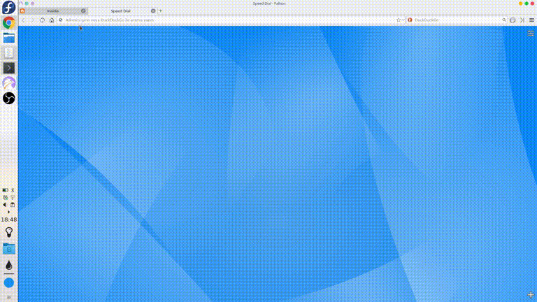

# Animalyst: A Simple Cutelyst Web Application

_This application and tutorial are based on the example in the [Quelques cadriciels Web C++](https://linuxfr.org/news/quelques-cadriciels-web-c-1-2) article published on [LinuxFr.org](https://linuxfr.org/)._

Currently, there are many interesting languages ​​and frameworks for server-side web development. In this area, C++ isn't the most fashionable language, but it has some interesting assets. Indeed:

* C++ has many libraries (including web frameworks)
* It's renowned for its performance
* Its latest standards make it more enjoyable to use

The purpose of this tutorial is to provide:

* A small comparison of Cutelyst with other C++ tools available for Web back-end development, based on a example application
* An introduction to application development with Cutelyst
* Some hints about deploying a Cutelyst project to production

Source codes for Cutelyst is included [here](https://github.com/maidis/animalyst). Source codes for other C++ web frameworks are available on [this Git repository](https://framagit.org/nokomprendo/tuto_fonctionnel/tree/master/posts/tuto_fonctionnel_31). The different frameworks that used are summarized in the appendix. Finally, a list of C++ libraries is available on [Awesome C++](http://fffaraz.github.io/awesome-cpp/).


## Part 1: Example Application, HTML Generation and Access to a Database

### Final Application

We want to implement an application that displays images of animals stored on the server. A form is used to indicate the beginning of the name of the animals to display. You can display the image in full size by clicking on the thumbnail and you can display an information page via a link at the bottom of the page. Animal data (names and file paths) are stored in a SQLite database on the server.



Here, the generation of HTML pages is performed on the server, although the current trend is rather to provide a server-side API and generate client-side HTML.

### MVC Architecture

In a very conventional way, one can organize the code of this application according to an architecture of MVC type, that is to say by distinguishing the data (model), their display (view) and their management (controller).

For our application, the images are available on the server and we use a SQLite database containing a table with the names and file paths of the animals. File `animals.sql`:

```sql
CREATE TABLE animals (
  id INTEGER PRIMARY KEY,
  name TEXT,
  image TEXT
);

INSERT INTO animals (name, image) VALUES('dolphin', 'dolphin-marine-mammals-water-sea-64219.jpg');
INSERT INTO animals (name, image) VALUES('dog', 'night-garden-yellow-animal.jpg');
INSERT INTO animals (name, image) VALUES('owl', 'owl.jpg');
...
```

The model part then comes down to a Animal type and a function getAnimals that queries the database and returns the type records Animal whose name begins with the given prefix. File Animal.hpp:

```cpp

```

The view part contains two functions returning pages in HTML format: renderAbout returns the information page and renderHome returns the main page with the animals requested by the user. File View.hpp:

```cpp

```

Finally, the controller part retrieves the client's events and then updates the model and the view. For our application, there is no complicated processing to perform, just to retrieve HTTP requests and to call the previous functions.

### HTML generation

#### HTML document generators

C++ does not seem to have as successful HTML document generation tools as Lucid in Haskell. The [CTML](https://github.com/tinfoilboy/CTML) library is used to define the tree structure of a document and then generate the corresponding HTML code. However, its syntax is quite verbose and there is no verification of tags.

#### Pattern systems

These systems consist of writing customizable templates, that is to say HTML code in which parameters are used which will be replaced by the values ​​indicated when rendering the template.

MVC frameworks typically offer advanced pattern systems, but there are also independent tools, for example [mustache](http://mustache.github.io/). Mustache is a formalism that has implementations in many languages, including several in C++. For example, animal-pistache/src/View.cpp use the [kainjow mustache](https://github.com/kainjow/Mustache) implementation and the following code ( animals-crow/src/View.cpp) the implementation of the crow framework:

```cpp
const string css = ...

string renderHome(const string & myquery, const vector<Animal> & animals) {

  // create the template 
  const string homeTmpl = R"(
    <html>
      <head>
        <style>
          {{mycss}}
        </style>
      </head>
      <body>
        <h1>Animals (Crow)</h1>
        <form>
          <p> <input type="text" name="myquery" value="{{myquery}}"> </p>
        </form>
        {{#animals}}
        <a href="static/{{image}}">
            <div class="divCss">
              <p> {{name}} </p>
              
            </div>
          </a>
        {{/animals}}
        <p style="clear: both"><a href="/about">About</a></p>
      </body>
    </html>
  )";

  // create a context containing the data to use in the template
  crow::mustache::context ctx;
  ctx["mycss"] = css;
  ctx["myquery"] = myquery;
  for (unsigned i=0; i<animals.size(); i++) {
    ctx["animals"][i]["name"] = animals[i].name;
    ctx["animals"][i]["image"] = animals[i].image;
  }

  // render the template using the context
  return crow::mustache::template_t(homeTmpl).render(ctx);
}

string renderAbout() {
    ...
}
```

#### Generation "by hand"

It is also relatively simple to generate HTML code manually, using C++ channel streams. However, this method does not facilitate code reuse or verification of the HTML code produced. Example of manual generation ( animals-silicon/src/main.cpp):

```cpp
string renderHome(const string & myquery, const vector<Animal> & animals) {

  // create a string stream
  ostringstream oss;

  // generate some HTML code, in the stream
  oss << R"(
    <html>
      <head>
        <link rel="stylesheet" type="text/css" href="mystatic/style.css">
      </head>
      <body>
        <h1>Animals (Silicon)</h1>
        <form>
          <p> <input type="text" name="myquery" value=")" << myquery << R"("> </p>
        </form>
    )";

  for (const Animal & a : animals) {
    oss << R"(
        <a href="mystatic/)" << a.image << R"(">
            <div class="divCss">
              <p>)" << a.name << R"(</p>
              
            </div>
          </a>)";
  }

  oss << R"(
        <p style="clear: both"><a href="/about">About</a></p>
      </body>
    </html>
  )";

  // return the resulting string
  return oss.str();
}

string renderAbout() {
    ...
}
```

### Access to an SQL database

#### SQL connectors

They make it possible to explicitly build SQL queries, send them to the database system and retrieve the result. SQL connectors are generally easy to use (just know the SQL language) but they do not check that the queries are correct.

Many frameworks offer SQL connectors. For example, cppcms (see animals-cppcms/src/Animal.cpp), tntnet (see animals-tntnet/src/Animal.cc) and silicon (see animals-silicon/src/main.cpp). There are also independent connectors, for example sqlite_modern_cpp (see animals-pistache/src/Animal.cpp):

```cpp
#include "Animal.hpp"
#include <sqlite_modern_cpp.h>

using namespace sqlite;
using namespace std;

vector<Animal> getAnimals(const string & myquery) {

  vector<Animal> animals;

  try {
    // open database
    database db("animals.db");

    // query database and process results
    db << "SELECT name,image FROM animals WHERE name LIKE ?||'%'" 
      << myquery
      >> [&](string name, string image) { animals.push_back({name, image}); };
  }
  catch (exception & e) {
    cerr << e.what() << endl;
  }

  return animals;
}
```

#### ORMs

Object-Relational Mapping (ORM) is used to convert data from a table in a database to a C++ class, and vice versa. This makes it possible to use the database more securely because the data are checked by the typing system and checked at compile time since the requests are made by C++ functions. However, an ORM defines its own abstraction layer equivalent to SQL, but necessarily less known.

There are different C++ ORMs, for example wt (see animals-wt/src/main.cpp), [sqlpp11](https://github.com/rbock/sqlpp11) (see animals-crow/src/Animal.cpp) or [sqlite_orm](https://github.com/fnc12/sqlite_orm) (see animals-cpprestsdk/src/Animal.cpp):

```cpp
#include "Animal.hpp"
#include <sqlite_orm/sqlite_orm.h>

using namespace std;
using namespace sqlite_orm;

vector<Animal> getAnimals(const string & myquery) {

    vector<Animal> animals;

    // open database and map the "animals" table to the "Animal" datatype
    auto storage = make_storage(
            "animals.db",
            make_table("animals",
                make_column("name", &Animal::name),
                make_column("image", &Animal::image)));

    // query database
    auto results = storage.get_all<Animal>(where(like(&Animal::name, myquery+"%")));

    // process results
    for(auto & animal : results)
        animals.push_back(animal);

    return animals;
}
```

## Part 2: Web frameworks

### Micro-frameworks like Sinatra/Flask

The Web micro-frameworks, like Sinatra in Ruby or Flask in Python, aim to be simple and light. They mainly offer features to handle HTTP requests as well as a URL routing mechanism. If necessary, they can be completed by other libraries (HTML generation, access to a database in SQL...).

There are several C ++ micro-frameworks, for example crow (see animals-crow) or silicon (see animals-silicon):

Here, the features of modern C ++ make the code concise and rather pleasant to read (for example, lambda for the road _animals).

In a pre-treatment phase, Silicon generates the file symbols.hh, which declares the symbols defined by the programmer, including roads ( _about, _home, _mystatic...). This makes it possible to statically verify that the routes are used correctly in the code. Other languages ​​use introspection to perform this kind of checking, but C++ does not have this feature.

### Asynchronous frameworks like Node.js

Asynchronous frameworks, like Node.js / Express in JavaScript, offer the same functionalities as conventional micro-frameworks but via non-blocking functions. Thus, if a request needs a resource, the application can switch to another request while waiting for the resource to be available. This improves the overall performance of the application but requires a particular programming style, based on promises connected to call-back functions by then to form a chain of asynchronous processing.

There are different asynchronous frameworks in C++, for example cpprestsdk (see animals-cpprestsdk) and pistachio (see animals-pistachio):

Here we find a classic management of roads (with the name of the road and its processing function). However, we now have asynchronous operation, via non-blocking functions. For example, for the "  static  " route, the function serveFilereturns a promise that is connected to a call-back function , which displays a log message once the promise is resolved.

### MVC frameworks like RoR / Django

MVC Web frameworks, such as Ruby on Rails or Python Django, are classic tools whose goal is to implement any type of Web application. They usually provide all the necessary features: URL routing, pattern system, access to databases, authentication system... The MVC frameworks do not seem to be the preferred domain of C++, but there are still some interesting tools, including cppcms.

In addition to the classic features of an MVC framework, cppcms offers a fairly advanced pattern system with view inheritance and content management. For example, one can define a main view MasterView and derive views from it AboutView and HomeView inherit the characteristics of MasterViewand complement them. Finally, we can associate a content to these views (parameters of the patterns), also with an inheritance system. Using the previous example, we can define a content MasterContentfor the view MasterView, derive it HomeContentfor the view HomeViewand use directly MasterContentfor the view AboutView(no new parameter in the pattern).

At the code level, the file animals-cppcms/src/content.hdefines the contents:

MVC frameworks are effective tools for implementing complex applications. However, they require a lot of training and can be oversized for small, simple applications.

### Frameworks based bosses at PHP

The tntnet framework offers a pattern- based system, similar to PHP. If this framework is rather anecdotal in the C++ ecosystem, it seems however rather effective in its approach: to write classic HTML code and to add sections of C++ code where it is necessary.

For example, the file animals-tntent/src/myimg.ecppdefines an application that displays an image whose name is passed as a parameter:

Note that this type of framework is perhaps less suited to the development of complex applications (readability of patterns, reuse ...).

### Widget-based frameworks

These tools are inspired by desktop graphical frameworks, such as Qt or gtkmm, that is, based on a hierarchy of widgets that make up the interface and interact via a signal-slot mechanism.

Web-based widgets are surprisingly unpopular, even in all languages, while their potential seems important. Indeed, they allow to develop a client-server fullstack application using a classic graphical interface library and without having to worry too much about the network architecture of the application.

In C++, the most successful framework in this category is certainly Wt. Wt has many classic or advanced widgets, a SQL ORM, an authentication system, the ability to manipulate HTML and CSS, etc. In Wt, the main program is to route URLs to the corresponding applications (animals-wt / src / main.cpp):

These Wt applications correspond to conventional graphical interfaces, but with a client-server architecture. For example, to define the application "about" (static page) via the system of HTML / CSS patterns, just define the following class ( animals-wt/src/AboutApp.hpp):

For a more complex application, for example the page displaying the animals, we can define a new widget AnimalWidget that implements a thumbnail, then use this class to display all the animals read in the database (see animals-wt/src/HomeApp.hpp):

At first glance, this implementation may seem longer and more complicated than previous implementations. However, its code should seem familiar to any desktop GUI developer. In addition, this implementation manages the entire application ( fullstack ), not the server part only. For example, connecting the signal _myquery->textInput()to the function HomeApp::filterAnimalsinvolves real-time client-side updates, which would be much harder to implement with previous frameworks.


## Conclusion

To develop back-end Web applications, C++ is a very feasible option. With its latest developments, the language is generally simpler and safer to use, without compromising on performance. Many C++ libraries are available for web development: patterns, HTML generation, SQL connection, ORM... Web frameworks are also numerous and varied: MVC framework at RoR / Django, Sinatra / Flask micro-framework, asynchronous framework to the Node.js, framework based PHP patterns, and even fullstack framework based widgets. Finally, we note that with Nix, it is very easy to configure a project integrating this kind of libraries. Of course, all this will mainly interest developers who already know C++, because many other languages ​​also have very interesting tools for Web development.


## Summary of projects and frameworks presented

| project | Web framework | HTML generator | SQL interface |
|---|---|---|---|
| [animals-cppcms](https://framagit.org/nokomprendo/tuto_fonctionnel/tree/master/posts/tuto_fonctionnel_31/animals-cppcms) | [cppcms](http://cppcms.com/wikipp/en/page/main/) (MVC framework) | cppcms (template system) | cppcms (SQL connector) |
| [animals-cpprestsdk](https://framagit.org/nokomprendo/tuto_fonctionnel/tree/master/posts/tuto_fonctionnel_31/animals-cpprestsdk) | [cpprestsdk](https://github.com/Microsoft/cpprestsdk) (asynchronous network framework) | [ctml](https://github.com/tinfoilboy/CTML) (document generator) | [sqlite_orm](https://github.com/fnc12/sqlite_orm) (ORM) |
| [animals-crow](https://framagit.org/nokomprendo/tuto_fonctionnel/tree/master/posts/tuto_fonctionnel_31/animals-crow) | http: [crow](https://github.com/ipkn/crow) (micro-framework) | crow (template system) | [sqlpp11](https://github.com/rbock/sqlpp11) (ORM) |
| [animals-nodejs](https://framagit.org/nokomprendo/tuto_fonctionnel/tree/master/posts/tuto_fonctionnel_31/animals-nodejs) (Javascript/Node.js) | [express](https://expressjs.com/) (micro-framework asynchrone) | [pug](https://pugjs.org) (générateur de documents) | [better-sqlite3](https://github.com/JoshuaWise/better-sqlite3) (connecteur SQL) |
| [animals-pistache](https://framagit.org/nokomprendo/tuto_fonctionnel/tree/master/posts/tuto_fonctionnel_31/animals-pistache) | [pistache](http://pistache.io/) (micro-framework asynchrone) | [kainjow mustache](https://github.com/kainjow/Mustache) (système de templates) | [sqlite_modern_cpp](https://github.com/SqliteModernCpp/sqlite_modern_cpp) (connecteur SQL) |
| [animals-scotty](https://framagit.org/nokomprendo/tuto_fonctionnel/tree/master/posts/tuto_fonctionnel_31/animals-scotty) (Haskell) | [scotty](http://hackage.haskell.org/package/scotty) (micro-framework) | [lucid](https://hackage.haskell.org/package/lucid) and [clay](https://hackage.haskell.org/package/clay) (générateurs de documents) | [sqlite-simple](https://hackage.haskell.org/package/sqlite-simple) (connecteur SQL) |
| [animals-silicon](https://framagit.org/nokomprendo/tuto_fonctionnel/tree/master/posts/tuto_fonctionnel_31/animals-silicon) | [silicon](http://siliconframework.org/) (micro-framework) | aucun | silicon (connecteur SQL) |
| [animals-tntnet](https://framagit.org/nokomprendo/tuto_fonctionnel/tree/master/posts/tuto_fonctionnel_31/animals-tntnet) | [tntnet](http://www.tntnet.org/tntnet.html) (framework basé templates) | tntnet (système de templates) | tntnet (connecteur SQL) |
| [animals-wt](https://framagit.org/nokomprendo/tuto_fonctionnel/tree/master/posts/tuto_fonctionnel_31/animals-wt) | [wt](https://www.webtoolkit.eu/wt) (widget based software) | wt (system of  widgets + templates) | wt (ORM) |
